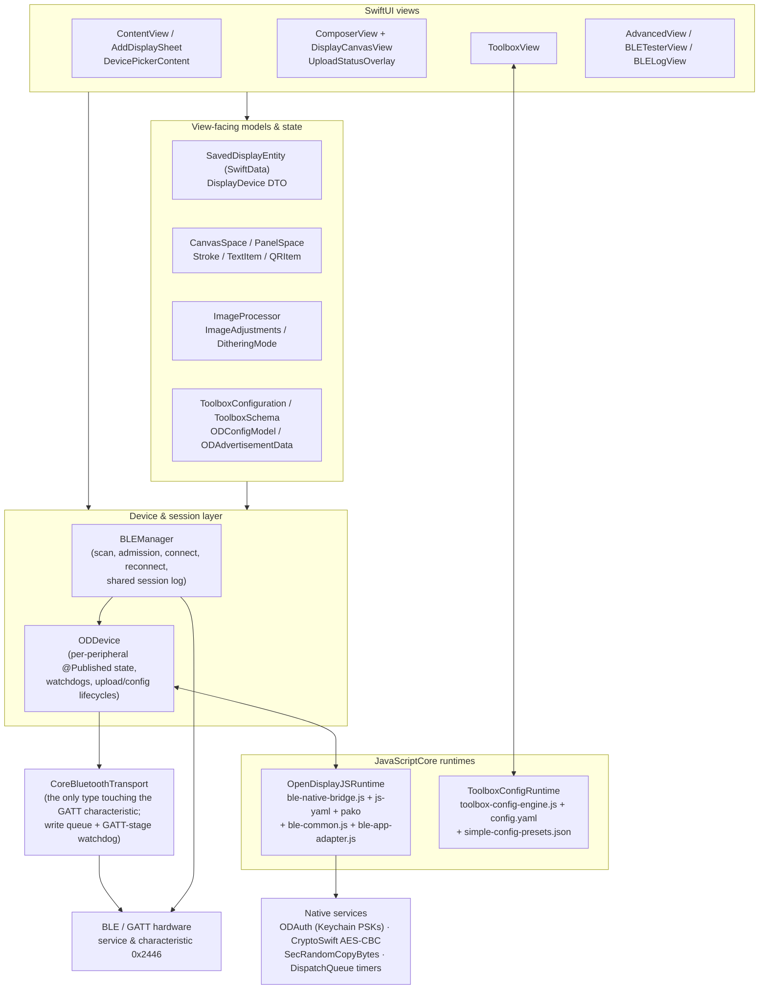
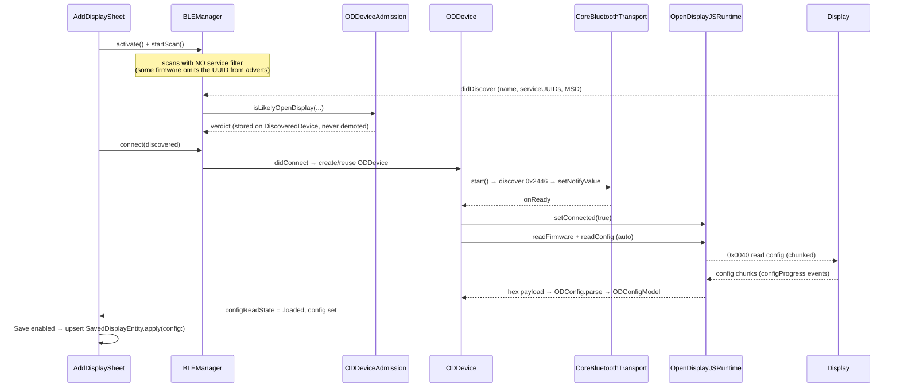
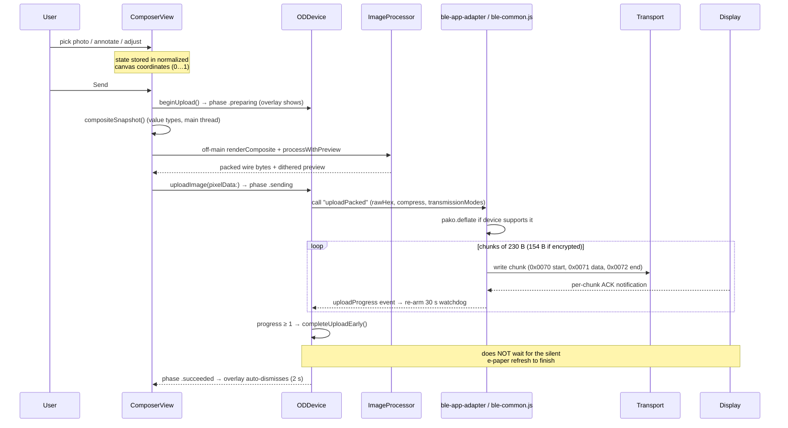

# OD App Architecture

_Surveyed against the `integration` branch (origin/main + PRs #16–#20), July 2026. App version 0.1.4, iOS 17+, bundle id `org.opendisplay.open-display-utility`._

## Overview

OD App ("OpenDisplay Utility") is an iOS SwiftUI app for OpenDisplay e-paper displays. It discovers OD hardware over Bluetooth LE, keeps a persistent "My Displays" registry, lets the user compose a photo with drawn strokes, text, and QR codes on a panel-shaped canvas, then dithers and bit-packs the result for the panel's color scheme and streams it to the display over a single GATT characteristic. It also exposes the full device-configuration "Toolbox" (the same schema-driven config editor as opendisplay.org) and raw engineering tools. The distinguishing architectural choice is that **the BLE protocol itself is not implemented in Swift**: the website's `ble-common.js` runs verbatim inside JavaScriptCore, with Swift providing the radio, the crypto primitives, timers, and the UI.

Tech stack: **SwiftUI** (all UI), **SwiftData** (saved-display registry), **CoreBluetooth** (radio), **JavaScriptCore** (two embedded JS engines: protocol + config codec), **CryptoSwift** (AES-CBC backing the JS `crypto.subtle` shim; the only SPM dependency).

## Layer map

Walk-through, top down:

- **SwiftUI views** own presentation and per-screen state only. `ContentView` is the home registry; `AddDisplaySheet` handles pairing and naming; `ComposerView` (1,387 lines, the largest view) owns the photo/annotation editing session; `ToolboxView` (1,246 lines) is the config editor; `AdvancedView` gates the engineering tools. One `BLEManager` is injected app-wide via `@EnvironmentObject` from `ODApp` — deliberately a single shared instance ("the old build made a fresh one per tool").
- **View-facing models** are value types: `SavedDisplayEntity` is the SwiftData `@Model` (with a `DisplayDevice` Codable DTO mirror), `CanvasSpace`/`PanelSpace` implement the normalized-coordinate model, `ImageProcessor` is a pure enum of dither/pack functions, and the `Toolbox*` structs decode the website's schema/preset JSON.
- **`BLEManager`** (`CBCentralManagerDelegate`, main queue) owns scanning, the admission heuristic, connect/reconnect, and the bounded shared traffic log. On `didConnect` it creates or reuses an **`ODDevice`** per peripheral.
- **`ODDevice`** is the observable app-facing device: `@Published` connection/auth/config/upload state, one stall watchdog per operation, and the translation between Swift calls and JS runtime operations. It is `CBPeripheralDelegate` but forwards every GATT callback to the transport.
- **`CoreBluetoothTransport`** is, per its own doc comment, "the only type allowed to touch the OpenDisplay GATT characteristic": service/characteristic discovery, notification enablement (`onReady` fires here), and a FIFO write-without-response queue drained on `canSendWriteWithoutResponse`.
- **`OpenDisplayJSRuntime`** hosts the verbatim web BLE library. `ble-native-bridge.js` polyfills `setTimeout`, `TextEncoder`, `crypto.getRandomValues`, `crypto.subtle.encrypt` (AES-CBC), and `fetch` (serving the bundled `config.yaml`); `ble-app-adapter.js` (the one Resources file the project allows editing) wires `OpenDisplayBLE` callbacks to the `__odCall`/`emit` operation protocol. JS "writes" round-trip through Swift (`onWrite` → transport) and device notifications are pushed back in via `__odNotify`. A **second, separate** JSContext — `ToolboxConfigRuntime` — runs `toolbox-config-engine.js` synchronously for schema parse/encode/decode/validate/build_simple; it never touches BLE.
- **BLE/GATT**: everything speaks one service/characteristic pair, `0x2446`, writes without response, responses via notifications.

Threading model: everything above the radio is **main-thread confined** — the `CBCentralManager` is created with `queue: .main`, `CoreBluetoothTransport.write` has a `dispatchPrecondition(.onQueue(.main))`, and both JSContexts are documented main-thread-only. The only off-main work is image processing (composite render, Core Image adjustments, dithering) which is snapshotted into value types first.

## Major flows

### 1. App launch & home screen

1. `ODApp` (`ODApp.swift`) creates the shared `BLEManager` as a `@StateObject` and attaches `.modelContainer(for: SavedDisplayEntity.self)` — the entire SwiftData schema is that one entity.
2. `BLEManager.init` runs a **DEBUG-only preflight** that constructs an `OpenDisplayJSRuntime` and assertion-fails if the bundled JS doesn't bootstrap — catching a broken `ble-common.js` at launch instead of first connect. Core Bluetooth itself is created lazily (`activate()`) only when the user asks to connect, so no Bluetooth permission prompt on first launch.
3. `RootView` overlays `SplashView` (brand palette lifted from opendisplay.org's CSS tokens, pinned to light appearance) for 5 seconds or until tapped.
4. `ContentView` `@Query`s `SavedDisplayEntity` sorted by `dateAdded`. Each row navigates to `ComposerView`; a per-row gear opens `AddDisplaySheet` in edit mode; the toolbar gear opens `AdvancedView`. Deleting a display also deletes its Keychain PSK and disconnects if it is the live connection.

### 2. Discover & add a display

Step-by-step:

1. `AddDisplaySheet` (`ContentView.swift`) calls `ble.activate()`/`startScan()` on appear. Scans run **without a service-UUID filter** because some OD firmware doesn't advertise the UUID; a `pendingScan` flag replays a scan requested before the central reaches `.poweredOn`.
2. Every discovered peripheral is stored; **admission** is decided by the pure, unit-tested `ODDeviceAdmission.isLikelyOpenDisplay` (`BLEManager.swift`): (a) name prefix `"OD"` — anchored, case-insensitive, against GAP name *or* advertised local name; (b) service UUID `0x2446` in the advertisement; (c) manufacturer data of **exactly 16 bytes** excluding Apple's company ID `0x004C`. The heuristic deliberately favors precision; the persisted "Show all devices" toggle is the recall safety net. Later packets can only upgrade a device's verdict, never demote it, and a scan-response without MSD/local name won't wipe previously seen values.
3. Tapping a row connects. `didConnect` reuses the cached `ODDevice` only if the `CBPeripheral` *instance* is identical (peripherals belong to the central that produced them); otherwise it builds a fresh one, seeding it with the advertised MSD.
4. `ODDevice.discoverServices()` → `CoreBluetoothTransport.start()` → discovery → notifications enabled → **`transport.onReady`**. Only there does `connectionState` become `.connected`, `runtime.setConnected(true)` fire, and the **automatic firmware + config read** kick off. (PR #17's fix: triggering the read from a view's `onChange` fired while the link was still `.connecting` and deterministically failed with "Not connected".)
5. The read drives **`ConfigReadState`** (`unread / reading / loaded / failed`), which the sheet renders as spinner / retry / cached-stale states. Concurrent callers *join* the in-flight read (`configReadCompletions`) instead of erroring.
6. Save is **disabled until a real config has been read** for a new display — persisting the fabricated 800×480 fallback as if confirmed is exactly the bug this flow exists to prevent. `SavedDisplayEntity.apply(config:)` is the only path that sets `resolutionConfirmed = true` (provenance flag; defaults false so migrated stores are treated as unconfirmed). Saving upserts by peripheral identifier. Names/locations are purely user-entered — the firmware exposes no name field over BLE.

### 3. Compose & send a photo

Step-by-step:

1. `PhotosPicker` → `loadPhoto` (`ComposerView.swift`): off-main EXIF orientation-normalize plus a **downscaled ≤1600 px preview copy** — live Core Image adjustments run only against the preview; the full-resolution original is kept for the final send. The picker binding is cleared immediately so re-picking the same asset still fires `onChange`.
2. All canvas geometry — stroke points, text/QR positions and sizes, and the photo `pan` — is stored **normalized (0…1) to the canvas box** (`CanvasCoordinates.swift`, types in `DisplayCanvasView.swift`). The box is always locked to the panel's aspect ratio, so lengths normalize by width alone and stay isotropic. Rotation, iPad window resize, or a late config aspect change preserves the composition with zero rescaling. Gesture baselines are captured at gesture *start*, pinch is reserved exclusively for photo zoom (`pinchActive` gates the drag layer), and element resize is done with sliders, not pinch.
3. Adjustments (`ImageAdjustments`: brightness/contrast/shadows/highlights/saturation/tone-compression) refresh the canvas via a **serial file-scope queue** with a monotonic render token that drops stale results — a fast slider drag can't stack concurrent Core Image renders and spike memory.
4. Send: `device.beginUpload()` flips the overlay to `.preparing` *before* the slow render. `compositeSnapshot()` captures all `@State` into a value struct on the main thread; `renderComposite` then rasterizes photo (aspect-fill + zoom + normalized pan) plus strokes/text/QR at native panel resolution off-main, entirely from `normalized × panelPixels`.
5. `ImageProcessor.processWithPreview` (`Models/ImageProcessor.swift`) runs one dither pass returning both the packed wire bytes and a preview `UIImage`. Pipeline: RGBA extraction → optional measured-palette tone compression (a formula-for-formula port of the epaper-dithering Rust `tone_map.rs`) → **OKLab palette matching + error diffusion in the Rust `epaper-dithering-core`**, called via `Models/RustDither.swift` over the vendored `Frameworks/EpaperDithering.xcframework` — so the dithered output is byte-for-byte identical to the website/Python reference; ImageProcessor no longer implements the matcher, it delegates → per-scheme bit packing (1bpp, dual bitplanes, 2bpp, 6-color nibble remap, 4-gray dual-plane LUT, 4bpp).
6. `ODDevice.uploadImage` validates the packed byte count against `expectedPackedByteCount` for the device's scheme, then calls the JS `uploadPacked`. `ble-app-adapter.js` applies the **compression gate mirrored line-for-line from opendisplay.org**: compress iff transmission-modes bit 0 (streaming decompression) is set; compressed uploads prepend a 4-byte size header to the `0x0070` Image Start; chunk size is 230 bytes (154 when the session is encrypted).
7. `ble-common.js` streams chunks with per-chunk ACKs and emits `uploadProgress`/`uploadStatus` events. The JS layer has **no timeouts**, so `ODDevice` arms a 30 s stall watchdog re-armed on every progress event — it fires only on a genuine gap, not a slow-but-advancing upload.
8. At `progress ≥ 1` the send **completes early** (`completeUploadEarly`): all chunks are acked, and the display's e-paper refresh (`0x73`, seconds to tens of seconds later, silent on BLE) is "the display's problem from here". The overlay shows the composite with the dithered result revealed left→right in lockstep with progress; terminal states auto-dismiss (success ~2 s, failure ~6 s with Retry).
9. During upload, `0x0071` chunk log entries are suppressed (hundreds of main-thread log updates otherwise) unless the DEBUG launch flag `-BLEVerbosePayloadLogging` is set — and only while `uploadPhase == .sending`, so a deliberate Tester send of `0x0071` stays visible.

### 4. Device configuration / Toolbox

1. `ToolboxView` (reached via Advanced → Device Configuration) gets its schema from **`ToolboxConfigRuntime.shared`** (`Protocol/ToolboxConfigRuntime.swift`) — a second, synchronous JSContext running `toolbox-config-engine.js` initialized with the bundled `config.yaml` (schema v1.3, 1,693 lines) and `simple-config-presets.json`. Operations: `schema`, `apply_schema`, `encode`, `decode`, `build_simple`, `validate`. Swift owns presentation; the YAML remains the protocol source of truth (no Swift codec duplication — `ToolboxPacketCodec` is a facade over the JS).
2. **Simple mode**: a premade-preset grid plus board/display/power pickers (`HardwareSectionView`, extracted and made `Equatable` so it doesn't re-render on every BLE notification). "Configure over Bluetooth" → `build_simple` in JS → write → reboot. A failed build **aborts before writing** (previously it fell through and wrote the previously-read config while reporting success — fixed in PR #18).
3. Simple-preset **catalog index round-trip**: `build_simple` writes each preset's explicit catalog `index` into `simple_config_*_index`, not its list position. `ToolboxIndexedPreset.presetIndex/id(forPresetIndex:)` (`Models/ToolboxData.swift`) invert that mapping; the old list-position lookup mis-mapped e.g. `ep75-800x480` (position 19, index 14) back to `ep42-400x300` and would have re-written the wrong panel config to real hardware. Three displays share `index: 33` in the Resources JSON — a data duplication Swift resolves deterministically (first match) but cannot fix.
4. **Read**: `ODDevice.readConfig` → JS chunked `0x0040` read → `ODConfig.parse` → `ToolboxConfigRuntime.decode` → `ToolboxConfiguration` (ordered `ToolboxPacket`s of string fields, plus an `unknownPacketTail` preserved byte-for-byte so firmware extensions this app can't interpret survive a read-edit-write cycle; structural edits are disabled while a tail exists).
5. **Write**: `ODDevice.writeConfig` encodes via JS, then counts chunk ACKs **natively** — this firmware never sends the `0x00CE/0x00CF` completion message `ble-common.js` waits for; it only echoes each chunk's command byte (`0x41`/`0x42`). The expected chunk count is predicted from `OD.configWriteChunkSize = 200`, which must track the bundled JS exactly (pinned by `BLEChunkSizeTests`). A 10 s watchdog covers a device that goes quiet; an in-flight-write flag rejects overlap.
6. **Deferred write on connect**: tapping Configure with no device arms `writeAfterConnecting`, opens the connection sheet, and fires the write only when `connectionState == .connected` (i.e. after `transport.onReady`) — writing at `didConnect` hit the characteristic before it existed. Disconnect or GATT failure while armed disarms and reports instead of wedging the Configure button (PR fixes).
7. Derived outputs (`encodedConfiguration`, validation) are **cached `@State`**, recomputed only on `configuration`/schema change — each encode/validate is a synchronous main-thread JS round-trip, and the view re-renders on every BLE notification. Swift adds validation the read-only engine lacks (`ToolboxSwiftValidation`: text-overflow and encryption-key-length warnings). Advanced mode also offers JSON import/export, a YAML schema editor, and a shareable `opendisplay.org/firmware/toolbox/?config=` URL.

### 5. Engineering tools

1. `AdvancedView` (home gear) hosts Device Configuration, **BLE Tester** (only when connected), **BLE Log**, and About.
2. `BLETesterView` sends preset commands (the `OD.Cmd` opcode table in `BLE/ODConstants.swift`: reboot, config, firmware, auth, image, LED, buzzer, NFC, DFU, deep sleep) or a raw opcode, each with an optional hex payload. Malformed payloads are rejected up front (they used to be silently dropped, sending a bare header). Sends go through `ODDevice.sendRaw` → JS `sendHex`; the spinner tracks the real completion, and a **successful send clears `lastError`** so one stale failure doesn't pin a red banner all session.
3. **Shared log pipeline**: every trace and packet flows `ODDevice.trace/appendLog` → `logHandler` closure → `BLEManager.appendLog`, a single bounded store (**cap 500 entries**, `trimmedCount` tracks drops so the UI and text export both disclose "showing the most recent N of M"). The Tester shows it oldest-first with auto-scroll keyed on the last entry's *id* (count is pinned once trimming starts); `BLELogView` shows the same store newest-first with direction filters and a plain-text ShareLink export. Both share one confirm-before-clear modifier since clearing is app-wide. Everything is mirrored to `os.Logger` categories (`ODLog`: ble/protocol/toolbox/imaging/auth).

### 6. Authentication / encryption

1. **Key storage is the only native crypto responsibility.** `ODAuth` (`Protocol/ODAuth.swift`) stores one 16-byte PSK per device id in the Keychain (`kSecClassGenericPassword`, service `com.opendisplay.psk`, accessible after first unlock) and generates random PSKs via `SecRandomCopyBytes` — never a predictable fallback.
2. `ODDevice.authenticate(psk:)` → JS `setEncryptionKey` + `authenticate`. The **protocol lives entirely in `ble-common.js`**: a server-challenge exchange over command `0x0050` — client nonce, AES-CMAC challenge response keyed on the master PSK, session-key derivation from both nonces, mutual verification of the server's MAC in constant time, session-ID derivation, replay window and rate limiting (10 attempts). Swift only flips `isAuthenticated` and arms a 10 s watchdog.
3. Once authenticated, `ble-common.js` **encrypts every outgoing command except `0x0050` (auth) and `0x0043` (firmware)** with the session key; image chunk sizes drop from 230 to 154 bytes to fit the encryption overhead.
4. The JS gets its primitives from `ble-native-bridge.js` shims backed by Swift: `crypto.getRandomValues` → `SecRandomCopyBytes`, and `crypto.subtle.encrypt` (AES-CBC/PKCS7) → **CryptoSwift** in `OpenDisplayJSRuntime.encryptAESCBC`. AES-CMAC is built in JS on top of that CBC primitive.
5. In the Toolbox, enabling encryption generates/accepts a 32-hex-char key, writes it into packet type 39 (`encryption_key`, `flags`, `reset_pin`), saves it as the device's PSK, and offers immediate authentication.

## Key design decisions & conventions

- **Verbatim shared JS engine.** `ble-common.js` (4,227 lines) is vendored unmodified from opendisplay.org so app and website can never drift on protocol behavior. It is guarded three ways: a `scripts/sync-ble-common.sh` update script, a SHA-256 pin enforced by the **"Verify ble-common.js" shell build phase** (`scripts/verify-ble-common.sh` — the build fails on any byte change), and the project rule that Resources files are never edited (the single sanctioned exception is `ble-app-adapter.js`, which is app-owned glue). Consequences of that rule show up as deliberate Swift-side duplication: the text-field special case in `ToolboxFieldDefinition.isTextField` mirrors the engine's `ssid`/`password` handling, `ToolboxSwiftValidation` adds checks the engine lacks, and the native chunk-ACK counter in `writeConfig` works around a JS completion the firmware never sends.
- **Two JSContexts, two interaction styles.** The BLE runtime is asynchronous and event-driven (operation ids, `emit` events, native-scheduled timers); the Toolbox runtime is synchronous request/response (`__odToolboxCall`). Keeping them separate means config encode/decode can't interleave with protocol state.
- **Main-thread confinement.** Radio callbacks, JS execution, and UI all share the main queue (JSContexts aren't thread-safe; CoreBluetooth is created with `queue: .main`; the transport write path asserts it). Heavy image work is the exception, and it crosses the boundary only via immutable snapshots.
- **The watchdog pattern.** `ble-common.js` has no timeout on any notification-driven exchange, so every native operation that waits on the device arms a `DispatchWorkItem` watchdog (`ODDevice.makeWatchdog`, mostly 10 s; upload 30 s; GATT stages 8 s in the transport). Progress events re-arm the config-read and upload watchdogs so only a genuine stall fires. `didDisconnect` cancels all six watchdog slots and drains in-flight completions with a definitive failure. The watchdog slots and the config-write ACK handler are *single shared slots* — overlapping operations of the same kind would clobber each other, which is why overlapping reads join and overlapping writes are rejected.
- **Normalized canvas coordinates.** All composition geometry is box-independent by construction (fractions of the canvas box; lengths normalized by width). Rotation/resize costs nothing, and the final render is `normalized × panelPixels` — proven equivalent to the old point→pixel math by `CanvasCoordinateTests`.
- **Admission favors precision.** Exact-16-byte MSD (not `>=`), anchored name prefixes kept to just `"OD"` (vendor ESLs running OD firmware are admitted via service UUID/MSD instead, so *stock* Hanshow/Solum units don't false-positive), Apple's company ID excluded. The "Show all devices" toggle is the escape hatch.
- **Config provenance.** `ConfigReadState` distinguishes "still fetching / read / failed" instead of overloading `nil`, and `resolutionConfirmed` records whether stored dimensions ever came from hardware. New displays can't be saved on a guess.
- **`pbxproj` strip-team filter.** `scripts/setup.sh` configures a git clean filter that deletes `DEVELOPMENT_TEAM` lines from the project file, keeping personal signing identity out of the repo.
- **Bounded logging with disclosure.** One 500-entry cap, one `trimmedCount`, and every surface (Tester, Log view, export) states when it's showing a trimmed tail.
- **Transitional/odd spots, plainly:** `Models/DevicePreset.swift` is referenced by nothing — a vestige of an older preset UI superseded by the JS-driven Toolbox catalog. Two `Info.plist` files exist (root, which the build uses, and an unused `OD App/Info.plist`). `ODConfigModel.deviceLabel` is a stubbed no-op awaiting a schema field. `ToolboxConfigRuntime.shared` `fatalError`s if its JS fails to load — a deliberate hard-fail (the app is useless without it) but still a crash path. The three-displays-share-`index: 33` duplication in `simple-config-presets.json` is acknowledged in code as unresolvable on the Swift side. `docs/audit/` and `docs/code-review.md` carry the findings that produced PRs #16–#20.

## Module inventory

| File | Responsibility | ~Size |
|---|---|---|
| `ODApp.swift` | `@main`; shared `BLEManager`, SwiftData container, splash presentation | 45 |
| `ContentView.swift` | Home registry, `AddDisplaySheet` (pair + name + config-gated save), reusable `DevicePickerContent` | 423 |
| `Views/ComposerView.swift` | Photo/annotation editing session, tool panels, send pipeline, `UploadStatusOverlay` | 1,440 |
| `Views/DisplayCanvasView.swift` | Aspect-locked canvas, gestures (pinch=zoom, drag, tap-place), hit-testing, QR generation/caching, annotation types | 640 |
| `Views/ToolboxView.swift` | Simple/Advanced config editor, packet editor, deferred write, import/export, schema editor | 1,246 |
| `Views/AdvancedView.swift` | Engineering-tools hub + `BLELogView` (filtered shared log, export) | 195 |
| `Views/BLETesterView.swift` | Raw/preset command sender, shared `LogEntryRow`, clear-log confirmation | 279 |
| `Views/AdvancedSettingsView.swift` | Per-display power controls (reboot, deep sleep, DFU) | 35 |
| `Views/SplashView.swift`, `ODLogoView.swift`, `Components/DeviceRowView.swift` | Splash (brand palette), logo, scan-list row | 132 |
| `BLE/BLEManager.swift` | Central manager, scan/admission (`ODDeviceAdmission`), connect/reconnect, bounded shared log, `DiscoveredDevice` | 446 |
| `BLE/ODDevice.swift` | Per-peripheral observable: config/upload/auth lifecycles, watchdogs, runtime event handling, native config-write ACK counting | 798 |
| `BLE/CoreBluetoothTransport.swift` | GATT discovery, notify enablement, write queue, stage watchdog | 174 |
| `BLE/ODConstants.swift` | Service/characteristic UUIDs, opcode table, chunk sizes, `ColorScheme`, `LogEntry` | 137 |
| `Protocol/OpenDisplayJSRuntime.swift` | JSContext bootstrap, operation/completion bridge, timers, RNG + CryptoSwift AES-CBC exports | 265 |
| `Protocol/ToolboxConfigRuntime.swift` | Synchronous Toolbox JS engine wrapper (schema/encode/decode/validate/build_simple) | 215 |
| `Protocol/ODAuth.swift` | Keychain PSK CRUD + secure random PSK | 69 |
| `Protocol/ODCommands.swift` | NFC payload builders (only commands the JS doesn't expose), `Data` hex/chunk helpers | 75 |
| `Protocol/ODConfig.swift` | `ODConfig.parse/serialize` facade over the JS codec | 12 |
| `Models/ImageProcessor.swift` | Adjustments (Core Image), tone compression (Rust port), delegates dithering to the Rust core, per-scheme wire packing | 480 |
| `Models/RustDither.swift` | Swift front door to the Rust `epaper-dithering-core` dithering FFI (`ed_dither`), via `Frameworks/EpaperDithering.xcframework` | 75 |
| `Models/CanvasCoordinates.swift` | `CanvasSpace`/`PanelSpace` normalized-coordinate conversions | 67 |
| `Models/ConfigModel.swift` | `ODConfigModel`: typed accessors over Toolbox packets (dimensions, scheme, transmission modes, PSK) | 115 |
| `Models/DisplayDevice.swift` | `SavedDisplayEntity` (SwiftData) + `DisplayDevice` DTO + `apply(config:)` provenance | 110 |
| `Models/ToolboxData.swift` | Schema/preset/catalog Codable models, indexed-preset round-trip, Swift-side validation, JSON document types | 404 |
| `Models/AdvertisementData.swift` | 16-byte MSD parser + config-dependent `ODAdvertisementLayout` (battery/touch/SHT40/buttons) | 266 |
| `Models/StringByteLimit.swift` | Grapheme-safe UTF-8 byte clamp + TextField modifier | 34 |
| `Models/ODLog.swift` | `os.Logger` registry | 22 |
| `Resources/ble-common.js` | Verbatim opendisplay.org BLE library: protocol framing, config read/write, image direct-write, auth/encryption | 4,227 |
| `Resources/ble-app-adapter.js` | App-owned glue: `__odCall` dispatch, `uploadPacked` with compression gate (editable) | 180 |
| `Resources/ble-native-bridge.js` | Browser-API polyfills backed by Swift (timers, crypto, fetch→config.yaml) | 110 |
| `Resources/toolbox-config-engine.js` | Schema-driven packet codec + `build_simple` + validation | 417 |
| `Resources/config.yaml` | Protocol schema (packet types, fields) — source of truth, read-only | 1,693 |
| `Resources/js-yaml.min.js`, `pako.js` | Vendored YAML parser and deflate | min |
| `scripts/` | `setup.sh` (strip-team filter), `sync-ble-common.sh` + `verify-ble-common.sh` (SHA-256 pin), `toolbox-config-smoke.swift` (manual smoke) | — |

**Xcode project**: two targets — `OD App` (iOS 17.0, Swift 5, `INFOPLIST_FILE = Info.plist`) and `OD AppTests` (hosted XCTest via `TEST_HOST`, so tests can read `Bundle.main` resources). Build phases include the **"Verify ble-common.js"** shell phase before compilation. One SPM dependency: **CryptoSwift**. Assets: `Assets.xcassets` with `ODLogo` (dark-appearance variant added in PR #19) and app icon.

## Test coverage map

Six test files (~600 lines) in `Tests/`, all fast and deterministic:

| Test file | Covers |
|---|---|
| `ODDeviceAdmissionTests` | The full admission predicate: anchored/case-insensitive prefixes on GAP and local names, service UUID, exact-16-byte MSD, Apple company-ID exclusion, no-signal rejection |
| `CanvasCoordinateTests` | Normalized-coordinate round-trip identity and **render equivalence** with the old point→pixel math across multiple box sizes |
| `BLEChunkSizeTests` | Pins `OD.configWriteChunkSize` to the literal `const chunkSize` in the *bundled* `ble-common.js` — the native ACK-count prediction breaks silently if they drift |
| `ToolboxConfigTests` | Bundled YAML loads (v1.3, packet 44 present), simple-preset build → encode → decode round-trip via the JS codec, and the catalog-index regression (`index: 14` vs list position 19, plus an exhaustive every-preset round-trip incl. the duplicate-33 case) |
| `ToneCompressionTests` | Swift tone-compression port validated against the epaper-dithering Rust reference anchors |
| `StringByteLimitTests` | Grapheme-safe UTF-8 truncation (boundary-straddling 2-byte chars and 4-byte emoji never split) |

**Notable gaps** — the tests concentrate on pure logic and JS-contract pins; the stateful core is untested:

- **`ODDevice`**: no tests for the watchdog lifecycle, upload phase machine, config-read joining/drain-on-disconnect, or the native config-write ACK counting (its chunk-size *input* is pinned, the counting logic isn't).
- **`BLEManager`**: connect/reconnect/deactivate state transitions, the pendingScan/pendingReconnect races the comments describe in detail — all uncovered (CoreBluetooth is hard to fake, but the logic isn't extracted for testing either).
- **`ImageProcessor` packing**: none of the seven wire-format packers (bitplanes, 6-color nibble remap, gray-4 LUT…) or `expectedPackedByteCount` have tests, despite being the exact bytes sent to hardware. Only tone compression is covered.
- **JS bridge**: `OpenDisplayJSRuntime`'s operation/completion/timer plumbing and `ble-app-adapter.js`'s compression gate have no automated coverage (the DEBUG launch preflight and the SHA pin are the only guards).
- **Advertisement parsing** (`ODAdvertisementData`/layout) and **UI** are untested; `scripts/toolbox-config-smoke.swift` exists as a manual macOS smoke-run of the Toolbox engine rather than a CI test.
